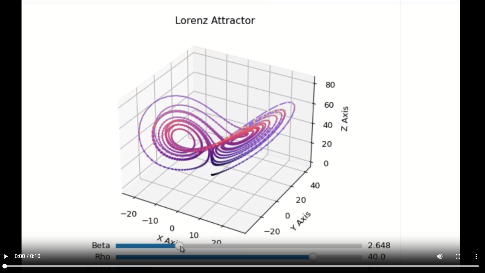
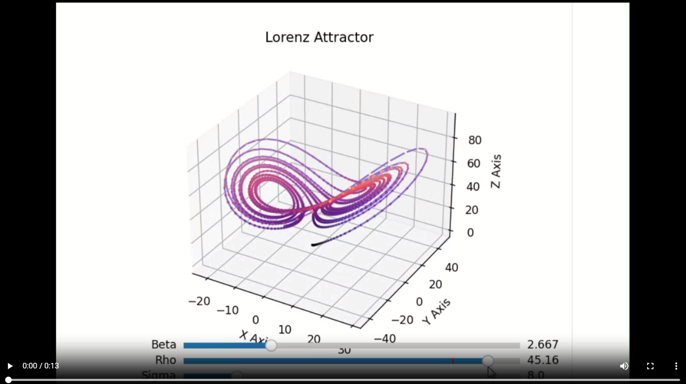
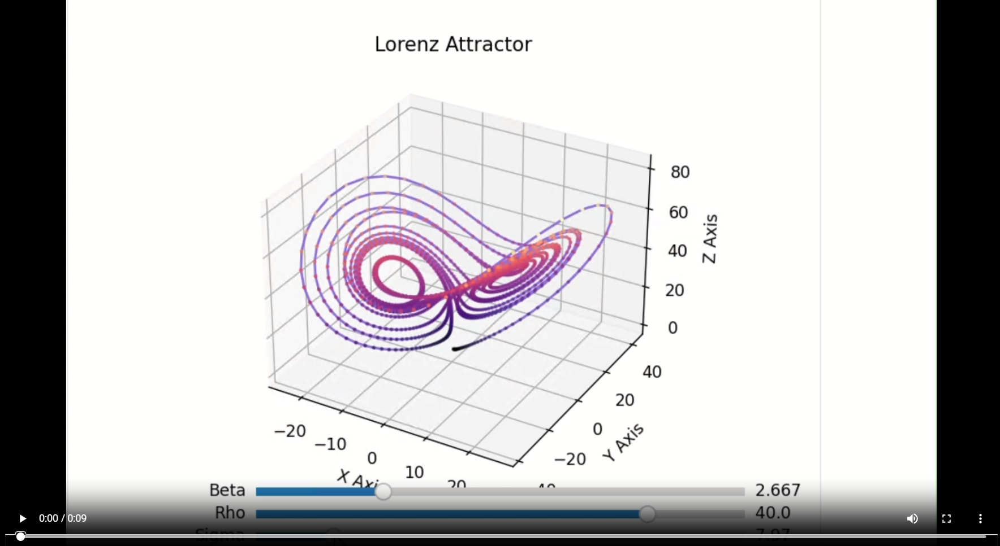

# L'EFFET PAPILLON DANS TOUTE SA SPLENDEUR
 
    Designed by the magnificients Suvana, Madina, Sathursjan

    
Liens vers les titres :
**|[Les bases de la théorie de l'attracteur de Lorenz](#introduction)|**
**[Les Equations et éléments à prendre en compte](#équations)|**
**[Comment modéliser le phénomène étudié](#modélisation)|**
**[Dépendance des paramètres du système/des conditions initiales ](#animation)|**
**[Exemple : influence de ρ pour démontrer la dépendance du systèmes sur les conditions initiales](#exemple)|**
**[Bibiliographie](#ressources)|**
**[Tableau de bord](#calendrier)|**

L'effet papillon, ou aussi appelé attracteur de Lorenz, a été découvert par Edward Lorenz, météorologue et mathématicien. En 1963, il développait une simulation des conditions atmosphériques avec 12 variables, et il remarque que la plus minuscule des différences dans les conditions initiales changeait grandement les résultats. 

Il simplifia alors sa simulation pour n'avoir que 3 variables tout en conservant cette dépendance sensible aux conditions initiales. Ce modèle simplifié décrit les cycles de convection dans l'atmosphère, qui est désormais plus connu sous le nom de *Système de Lorenz*. 

Ses recherches sont basées sur un principe fondamental, la dépendance sensible aux conditions initiales dans un système dynamique non linéaire.


# <a name="introduction"></a> Les bases de la théorie de l'attracteur de Lorenz   

Pour commencer, vous devez connaître ce qu'est le concept de la théorie du chaos et la dépendence des conditions initiales. 


Il y a trois points qui expliquent clairement les bases qui ont permis à la théorie de l’attracteur de Lorenz d’exister :

- La dépendance sensible aux conditions initiales
- La conséquence des changements des états initiaux : entraîner de grandes différences dans un état ultérieur
- Principalement tirée de la théorie du chaos, crée également par Edward Lorenz

Explication plus précise :

L’attracteur de Lorenz est la théorie qu’une simple action, qui paraît être un détail futile, peut avoir de conséquences hors-norme sur le système. Prenons un exemple :

On est ici dans un système dit chaotique, et vous allez comprendre pourquoi. Prenons un ensemble de boules de billard,et que l’on vient frapper une seule de ces boules, même en étant extrêmement précis, il est impossible que la boule de billard tape exactement au même endroit avec la même force deux fois de suite.
Ainsi, la conséquence qui va s’en suivre, c’est qu’il n’y aura jamais deux parties qui se ressembleront.

 

Comme il n’a suffi que d’un tout petit écart au moment de la frappe pour obtenir un résultat totalement différent, on dit que le jeu du billard est un système chaotique.

En résumé, si on a deux états presque identiques, ils évolueront vers des états radicalement différent après les avoir itérés à travers une fonction chaotique. 
 
Ici, on a un exemple assez général de l’attracteur de Lorenz, passons maintenant à une explication plus « scientifique ».

# <a name="équations"></a>  Les Equations et éléments à prendre en compte


x, y, z :, x, y et z sont 3 variables, x représente l'écoulement convectif sur l'espace étudié, y et z sont les variation de température horizontale et verticale.  
σ, ρ, β : Ces éléments numériques sont les paramètres de l'attracteur de Lorenz, modulant les trajectoires et influençant la sensibilité aux conditions initiales. σ représents [le nombre de Pandtl](https://fr.wikipedia.org/wiki/Nombre_de_Prandtl). ρ représente la différence de témpérature entre le point le plus haut et le plus bas de l'atmosphère et β represente le rapport de la largeur à la hauteur du plan de l'atmosphère étudiés. 

- Ici, ce qu'il faut comprendre, c'est que les équations données représentent une forme géometrique complexe de l'attracteur de lorenz, ou plus précisément, le comportement "chaotique" d'un système dynamique en trois dimensions.
- Les variables x, y et z, représentent un point d'intérêt dans l'espace en question, décrivant la position de ce point à un moment donné.
- σ, ρ et β, représentent les trajectoires et influencent la sensibilité aux conditions initiales, ce sont donc ces éléments là qui vont nous intéresser car c'est selon ces variables que les conditions initiales se définissent et font qu'on obtienne des résultats totalement différents à la fin. 

Pour vous expliquer cette partie un peu plus en detail, nous allons la modéliser.


#  <a name="modélisation"></a> Comment modéliser le phénomène étudié 

Voici les étapes clés qui vont nous permettre de modéliser l'attracteur de lorenz, elles vous permettront de mieux cerner les paramètres.
### Les bibiliothèques utilisées:

```py
import numpy as np
import matplotlib.pyplot as plt
from scipy.integrate import odeint
```


### Définir les Équations du Système Dynamique:

- Établir les équations fondamentales de Lorenz.
- Description de la dynamique tridimensionnelle du système.

```py
sigma = 10
rho = 28
beta = 2.667
def lorenz(x, y, z, sigma, rho, beta):
    deriv_x = sigma*(y - x)
    deriv_y = rho*x - y - x*z
    deriv_z = x*y - beta*z
    return deriv_x, deriv_y, deriv_z
```
     

### Définir les Valeurs Initiales:

- Préciser les conditions de départ pour x, y, et z.
- Préciser le temps entre chaque pas. 
- Définir un tableau "t" qui représente les instants de temps auxquels le système de Lorenz est évalué.
- rôle majeur dans la trajectoire globale de l'Attracteur.
```py
dt = 0.009999
t = np.arange(0, dt*2000, dt) 
etat_initial = [0.0, 2.0, 6.0]
```


### Résolution de l'équation différentielle du système de Lorenz:

- Utiliser la fonction "odeint" pour pouvoir intégrer et ainsi résoudre l'équation différentielle du système.

- Obtenir les tableaux de x,y,z contenant les valeurs des variables x, y et z du système de Lorenz à différents instants de temps, ce qui nous permet ensuite de visualiser et d'analyser l'évolution de ces variables au fil du temps.

```py
solution = odeint(lorenz, etat_initial, t, args=(sigma, rho, beta))

x = solution[:, 0]
y = solution[:, 1]
z = solution[:, 2]
```

### Procéder au Plot:

- Transposer les résultats dans un graphique.
- Observer et analyser la forme résultante de l'Attracteur de Lorenz.
- Observer l'évolution des conditions initiales x,y,z en fonction du temps.
  
```py
ax = plt.figure().add_subplot(projection='3d')
ax.scatter(x, y, z,s = 2)
ax.plot(x, y, z, color = 'r')
ax.set_xlabel("X Axis")
ax.set_ylabel("Y Axis")
ax.set_zlabel("Z Axis")
ax.set_title("Lorenz Attractor")

plt.show()
```


```py
fig, ax = plt.subplots(1, 3, figsize=(10, 3))

ax[0].plot(t,x, color='r', alpha=1, linewidth=0.6)
ax[0].set_xlabel("TIME Axis")
ax[0].set_ylabel("X Axis")

ax[1].plot(t,y, color='b', alpha=1, linewidth=0.6)
ax[1].set_xlabel("TIME Axis")
ax[1].set_ylabel("Y Axis")


ax[2].plot(t,z, color='g', alpha=1, linewidth=0.6)
ax[2].set_xlabel("TIME Axis")
ax[2].set_ylabel("Z Axis")

plt.show()
```


# <a name="animation"></a> Dépendance des paramètres du système/des conditions initiales 

Ici on retrouve les sliders effectués qui permettent de modifier les paramètres du système de Lorenz ainsi que les conditions initiales manuellement pour mieux voir la différence dans la trajectoire de l'attracteur de lorenz.

***Bibliothèques Utilisées :***
- numpy: Utilisée pour la manipulation efficace des tableaux et des opérations mathématiques.
- matplotlib.pyplot: Utilisée pour créer des graphiques et des visualisations.
- matplotlib.widgets.Slider: Utilisée pour créer des sliders interactifs.
- scipy.integrate.odeint: Utilisée pour résoudre les équations différentielles.

```py
import numpy as np
import matplotlib.pyplot as plt
from matplotlib.widgets import Slider
from scipy.integrate import odeint
```

***configuration des slides*** 
- Trois sliders interactifs sont créés pour ajuster les paramètres du système de Lorenz : σ, ρ et β.
- Chaque slider est associé à un axe spécifique dans la figure.

```py
ax_sigma = plt.axes([0.25, 0.02, 0.65, 0.03], facecolor='goldenrod')
ax_rho = plt.axes([0.25, 0.06, 0.65, 0.03], facecolor='goldenrod')
ax_beta = plt.axes([0.25, 0.1, 0.65, 0.03], facecolor='goldenrod')

sigma_initial = 8
rho_initial = 40
beta_initial = 2.667

s_sigma = Slider(ax_sigma, 'Sigma', 0.1, 50.0, valinit=sigma_initial)
s_rho = Slider(ax_rho, 'Rho', 0.1, 50.0, valinit=rho_initial)
s_beta = Slider(ax_beta, 'Beta', 0.1, 10.0, valinit=beta_initial)
```
- Les valeurs minimales et maximales des sliders sont fixées pour chaque paramètre.
- La valeur initiale de chaque slider est définie pour correspondre aux valeurs initiales des paramètres.

***Mise à jour des Sliders :***
- Lorsque la valeur de l'un des sliders est modifiée, la fonction update est appelée pour recalculer les valeurs des variables x, y et z en fonction des nouveaux paramètres.

```py
def update(val):
    sigma = s_sigma.val
    rho = s_rho.val
    beta = s_beta.val

    # Recalcul des valeurs de x, y, z avec les nouveaux paramètres
    solution = odeint(lorenz, etat_initial, t, args=(sigma, rho, beta))
    x = solution[:, 0]
    y = solution[:, 1]
    z = solution[:, 2]

    # Mise à jour du graphique avec les nouvelles données
    ax.clear()
    ax.scatter(x, y, z, s=2)
    ax.plot(x, y, z, color='r')
    ax.set_xlabel("Axe X")
    ax.set_ylabel("Axe Y")
    ax.set_zlabel("Axe Z")
    ax.set_title("Attracteur de Lorenz")
    plt.draw()

# Ajout des fonctions de mise à jour aux sliders
s_sigma.on_changed(update)
s_rho.on_changed(update)
s_beta.on_changed(update)
```

- À chaque modification de la valeur d'un slider, la fonction update est appelée pour recalculer les valeurs de x, y et z avec les nouveaux paramètres sigma, rho et beta.
- Ensuite, le graphique est mis à jour avec les nouvelles valeurs.


##### **β slider** 
[]( https://github.com/are-dynamic-2024-g3/effet-papillon.github.io/assets/160218534/bfac7989-f715-4363-b5ee-5d940a32acca)

##### **ρ slider** 
[](https://github.com/are-dynamic-2024-g3/effet-papillon.github.io/assets/160218534/1224b559-0817-4ea0-b12b-bd570d5aa1b9)

##### **σ slider** 
[](https://github.com/are-dynamic-2024-g3/effet-papillon.github.io/assets/160218534/8bec67b9-86d6-4b76-8d34-5cce2c719ca5)


Vous avez pu voir à quel point les trajectoires changent en fonction des conditions initiales, comment le graphique change de forme. Mais voyons en détails un exemple : 

## <a name="exemple"></a>Exemple : influence de ρ pour démontrer la dépendance du systèmes sur les conditions initiales

Pour être plus précis, on utilise 2 sous graphiques, un plan XZ et un plan X en fonction du temps. 
Les graphiques suivants utilisent les conditions initiales σ = 10, β = 8/3, temps = 60 secondes, seul rho est modifié. 
On utilise 2 points de départs légèrement différents, un en violet (0, 1, 0) et un en vert (0, 1.01, 0). 


Pour ρ = 10, les orbites verts et violets semblent se comporter de manière similaire au fil du temps; leurs trajectoires sont très similaires. Par conséquent, aucun chaos n'est présent dans cette équation. 

] 

Pour ρ = 20, bien que les orbites vertes et violets montrent toujours des comportements similaires sur le plan x-z et au fil du temps, des signes de sensiblité aux conditions initiales commencent à apparaître. Ces résultats sont cohérents avec une valeurs de ρ située dans une région où le système montre des signes de transitions vers le chaos. 


Pour ρ = 27, les graphiques de Lorenz révèlent clairement des signes de chaos. Les orbites vertes et violete montrent des trajectoires nettement différents sur le plan x-z et au fil du temps. Ces résultats sont cohérents avec une valeur de ρ située dans une région où le système exhibe clairement un comportement chaotique.

Ici, nous venons de voir que le paramètre ρ joue un rôle crucial dans le comportement des systèmes décrits par l'équation de Lorenz. Des valeurs plus basses de ρ sont associées à la stabilité et à la prédictibilité, tandis que des valeurs plus élevées peuvent engendrer du chaos et une sensibilité accrue aux conditions initiales. On peut en déduire pareillement pour β et σ (mais ça serait trop long). ***Ces conclusions soulignent la complexité des systèmes dynamiques non linéaires et mettent en évidence l'importance de bien comprendre les interactions entre les paramètres pour prédire avec précision le comportement à long terme du système.***

###  <a name="ressources"></a> Bibiliographie : 

[Comprendre la théorie](https://couleur-science.eu/?d=717abd--cest-quoi-un-attracteur-de-lorenzun-systeme-chaotique)

[Comprendre la théorie en détail](https://links.uwaterloo.ca/pmath370w14/PMATH370/lorenz%20Latex.pdf) 

[Visualisation des changements des paramètres en fonction du temps](https://tng-daryl.medium.com/visualizing-the-lorenz-attractor-in-julia-c9417f219e9b)

[Sliders](https://www.geeksforgeeks.org/matplotlib-slider-widget/amp/)

[Couleurs_matplotlib](https://matplotlib.org/stable/users/explain/colors/colormaps.html)

[Spicy.integrate](https://cpge.frama.io/fiches-cpge/Python/%C3%89quation%20diff%C3%A9rentielle/0-Equation%20diff%C3%A9rentielle/)

[Animation]( https://resteche.github.io/REsteche_blog/chaos%20theory/butterfly%20effect/python%20animation/2021/10/20/Lorenz_animation.html)

[Création_gif](https://www.developpez.net/forums/d1453508/autres-langages/python/calcul-scientifique/creer-gif-annime-pil/)

###  <a name="calendrier"></a> Tableau de bord : 

* SEANCE 1 : Nous avons rassemblé les informations sur l’attracteur de lorenz, réparti les tâches, et avons essayé de se familiariser avec github . 

* SEANCE 2 : Après avoir acquis les bases, nous avons fait la mise en page du site web, introduit l’attracteur de lorenz, sans codage, seulement du texte dans le readme. Cela nous a permis d’organiser le site et d’avoir un aperçu de ce qu’on pouvait faire ou non. Nous nous sommes basés sur le diaporama fait pour présenter notre projet, pour pouvoir agencer notre site.

* SEANCE 3 : Durant cette séance, nous nous sommes focalisés sur la modélisation et l’animation de l’attracteur de lorenz, l’idée était de pouvoir voir l’attracteur de lorenz sous ses différentes formes lorsque les conditions initiales sont modifiées. 

* SEANCE 4 : Nous nous sommes répartis les tâches qui nous restaient, améliorer la mise en page du readme, et avons travaillé sur les sliders de nos modélisations.

* SEANCE 5 : Nous avons importé des sliders interactifs avec matplotlib et %matplotlib notebook, nous sommes sur le peaufinement des modélisations, pour pouvoir les importer sur notre readme comme nous le souhaitions. Le principal problème était que nous ne pouvions pas faire de modèle interactifs avec l’utilisateur du site. Nous avons également exporté notre readme vers un site.

* SEANCE 6 : Nous avons rajouter des liens de racourcis dans le site pour accéder aux paragraphes plus rapidement, nous avons fait une recherche par rapport aux thèmes qu’on peut utiliser pour le site, et tester differents thèmes.

* SEANCE 7 :  Nous avons rajouté des liens de racourcis dans le site pour accéder à ces derniers plus rapidement, et avons rajouté un fichier mp4 pour la vidéo sur les sliders.
  
* SEANCE 8 : Nous avons fait des recherches plus détaillée sur les paramètres du système de Lorenz afin de bien expliquer le comportement de ces derniers lors du changement en fonction du temps et leurs influences sur la trajectoire. Nous avons rajouté un code pour les graphiques qui représentent les conditions initiales en focntion du temps.


